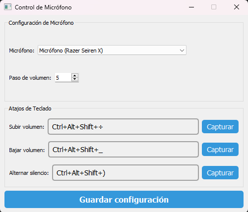
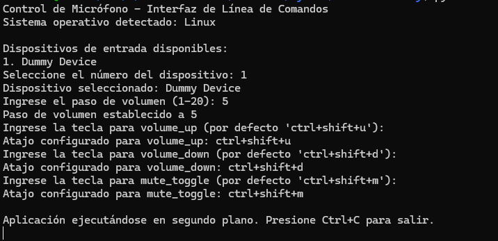

# Control de Micrófono

Control de Micrófono es una aplicación multiplataforma desarrollada en Python que permite a los usuarios controlar fácilmente el volumen y el estado de silencio de sus micrófonos. La aplicación ofrece una interfaz gráfica para Windows y una interfaz de línea de comandos para sistemas basados en Unix (Linux, macOS).




## Características

- Control de volumen del micrófono con atajos de teclado personalizables
- Silenciar/Activar el micrófono con un atajo de teclado
- Interfaz gráfica de usuario intuitiva (Windows)
- Interfaz de línea de comandos (Linux, macOS)
- Tooltips con iconos del sistema para mostrar el estado del micrófono (Windows)
- Alertas visuales integradas en la interfaz (Windows)
- Funciona en la bandeja del sistema para un acceso rápido (Windows)
- Soporte para múltiples dispositivos de entrada de audio
- Ejecución en segundo plano con atajos de teclado globales (todas las plataformas)

## Requisitos previos

- Python 3.11+
- Dependencias adicionales (ver `requirements.txt`)

## Instalación

1. Clona este repositorio o descarga el código fuente:

   ```
   git clone https://github.com/glamura/Microphone-Control.git
   cd Microphone-Control
   ```

2. Instala las dependencias necesarias:
   ```
   pip install -r requirements.txt
   ```

## Uso

### En Windows

Para iniciar la aplicación en Windows, ejecuta:

```
python main.py --minimized
```

La aplicación se iniciará y aparecerá un icono en la bandeja del sistema. Haz clic derecho en el icono para acceder a las opciones o haz doble clic para abrir la ventana principal.

#### Configuración en Windows

1. Selecciona el micrófono que deseas controlar en el menú desplegable.
2. Ajusta el paso de volumen según tus preferencias.
3. Configura los atajos de teclado para subir/bajar volumen y silenciar/activar el micrófono.
4. Haz clic en "Guardar configuración" para aplicar los cambios.

### En Linux y macOS

Para iniciar la aplicación en sistemas basados en Unix, ejecuta:

```
python main.py
```

La aplicación se iniciará en modo de línea de comandos y te guiará a través del proceso de configuración.

#### Configuración en Linux y macOS

1. Selecciona el dispositivo de entrada de audio.
2. Establece el paso de volumen (1-20).
3. Configura los atajos de teclado para cada acción:
   - Subir volumen (por defecto: ctrl+shift+u)
   - Bajar volumen (por defecto: ctrl+shift+d)
   - Silenciar/Activar (por defecto: ctrl+shift+m)

Después de la configuración, la aplicación se ejecutará en segundo plano y responderá a los atajos de teclado configurados.

## Atajos de teclado

### Windows

Los atajos de teclado son completamente personalizables a través de la interfaz gráfica.

### Linux y macOS

Los atajos de teclado predeterminados son:

- Subir volumen: Ctrl+Shift+U
- Bajar volumen: Ctrl+Shift+D
- Silenciar/Activar: Ctrl+Shift+M

Estos atajos se pueden personalizar durante la configuración inicial.

## Estructura del proyecto

El proyecto sigue una arquitectura hexagonal (puertos y adaptadores):

- `src/`
  - `domain/`: Entidades y puertos del dominio
  - `application/`: Servicios de aplicación
  - `infrastructure/`: Adaptadores para interactuar con el sistema
  - `interfaces/`: Interfaces de usuario (GUI y CLI)
- `main.py`: Punto de entrada de la aplicación

## Desarrollo

### Entorno de desarrollo

1. Clona el repositorio
2. Instala las dependencias de desarrollo:
   ```
   pip install -r requirements.txt
   ```
3. Ejecuta la aplicación en modo de desarrollo:
   ```
    python main.py
   ```

## Licencia

Distribuido bajo la Licencia MIT. Ver `LICENSE` para más información.

## Contacto

Link del Proyecto: [https://github.com/glamura/Microphone-Control](https://github.com/glamura/Microphone-Control)


